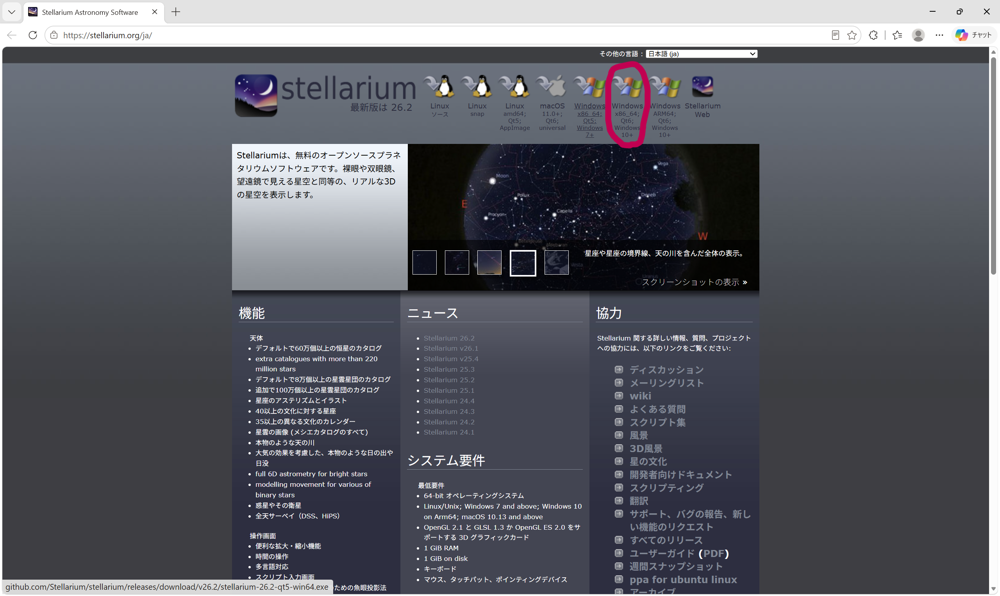
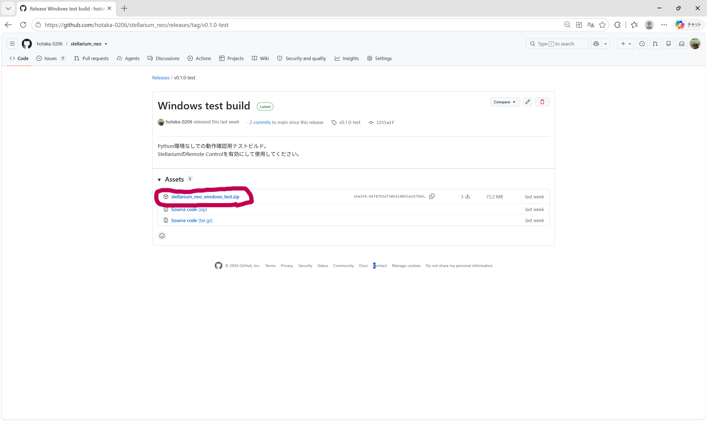
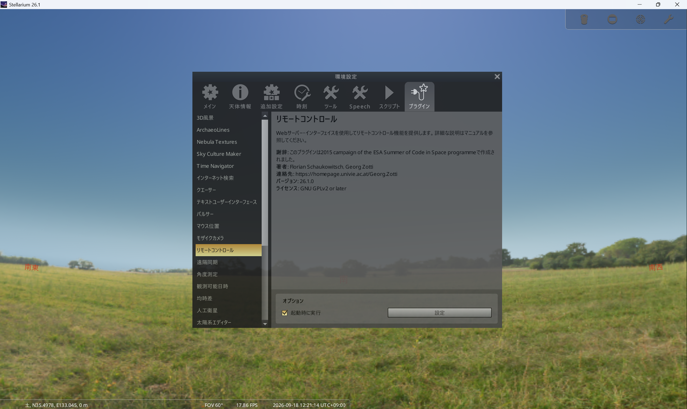
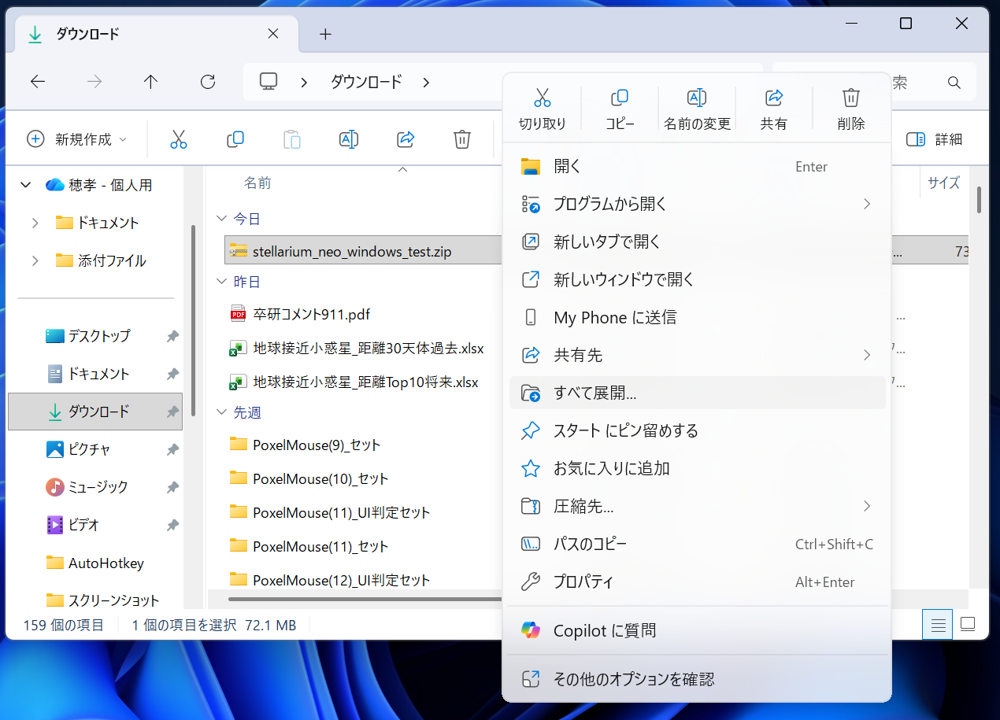
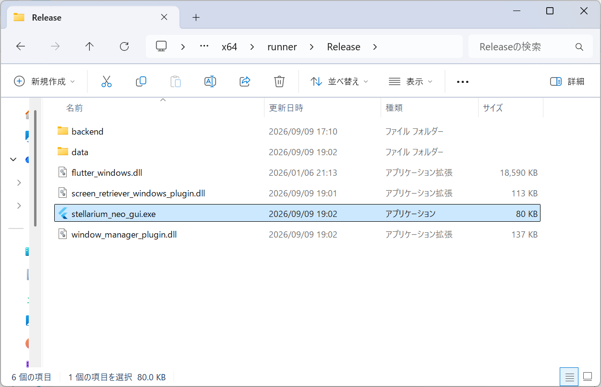

# Windows版 使用手順

## 1. Stellariumをインストールする

すでにStellariumがインストールされている場合は、[2. プログラムをダウンロードする](#2-プログラムをダウンロードする)へ進んでください。

### 1-1. Stellariumをダウンロードする

Stellarium公式サイトを開きます。

> **Stellarium公式サイト**
>
> https://stellarium.org/ja/

公式サイト上部にWindows向けのダウンロード項目があります。

通常のWindows 10 / 11を使用している場合は、

**`Windows x86_64; Qt6; Windows 10+`**

を選択してください。

2026年9月時点のStellarium最新版は **26.2** で、ダウンロードされるインストーラーは次のファイルです。

`stellarium-26.2-qt6-win64.exe`

ARM版Windows PCの場合は通常版とは異なるため、

**`Windows ARM64; Qt6; Windows 10+`**

を使用します。

---

### 1-2. Stellariumをインストールする

ダウンロードした

`stellarium-26.2-qt6-win64.exe`

をダブルクリックします。

通常はエクスプローラーの

**「ダウンロード」**

フォルダに保存されています。

インストーラーが起動したら、画面の指示に従ってインストールします。

基本的には次の順番で進めます。

1. インストールに使用する言語を選択する
2. 「次へ」を押す
3. ライセンス内容を確認して同意する
4. インストール先を確認して「次へ」を押す
5. スタートメニューフォルダーを確認して「次へ」を押す
6. 必要に応じてデスクトップアイコンなどを選択する
7. 「インストール」を押す
8. インストール終了後に「完了」を押す

インストール先などを変更する必要がなければ、基本的には初期設定のままで構いません。

インストールが完了したら、Stellariumを起動してください。

---

## 2. プログラムをダウンロードする

GitHubのこのリポジトリを開きます。
https://github.com/hotaka-0206/stellarium_neo/releases/tag/v0.1.0-test

現在のテスト版では、

**Windows test build**

を使用します。

Releaseページの **Assets** を開き、Windows用のZIPファイルをダウンロードしてください。

### Source codeは使用しない

Assetsには、

* Windows用の配布ファイル
* Source code (zip)
* Source code (tar.gz)

などが表示されます。

`Source code` ではなく、**Windows用として配布されているZIPファイル**をダウンロードしてください。

---

## 3. ZIPファイルを展開する

Windowsの **エクスプローラー** を開きます。

左側の一覧から **「ダウンロード」** を開くと、先ほどダウンロードしたZIPファイルがあります。

ZIPファイルを右クリックして、

**「すべて展開」**

を選択します。

展開先は変更せず、そのまま **「展開」** を押して構いません。

### ZIPファイルの中から直接起動しない

ZIPファイルをダブルクリックすると中のファイルを見ることができますが、その状態からプログラムを起動しないでください。

必ず **「すべて展開」** を行い、展開後のフォルダを使用してください。

---

## 4. StellariumのRemote Controlを有効にする

Stellariumを起動します。

全画面表示からウィンドウ表示に戻したい場合は、

`F11`

を押します。

PCによっては、

`Fn + F11`

を押す必要があります。

---

### 4-1. Remote Controlプラグインを有効にする

Stellarium上で `F2` キーを押します。

設定画面が開いたら、

1. **「プラグイン」** を選択する
2. 一覧から **「リモートコントロール」** を選択する
3. **「起動時に実行」** にチェックを入れる

という順番で操作します。

---

### 4-2. 「設定」ボタンが押せない場合

初めてRemote Controlを有効にした場合、**「設定」ボタンが押せない状態になっている場合があります。**

その場合は、

1. **「起動時に実行」** にチェックが入っていることを確認する
2. Stellariumを終了する
3. Stellariumをもう一度起動する
4. `F2` を押す
5. 「プラグイン」→「リモートコントロール」を開く

という操作を行ってください。

再起動後はRemote Controlプラグインが読み込まれ、**「設定」ボタンを押せるようになります。**

「設定」ボタンが最初から押せる場合は、そのまま次へ進んで構いません。

---

### 4-3. Remote Controlを設定する

**「設定」** を押します。

Remote Controlの設定画面で、次の項目を有効にします。

* **サーバーが利用可能**
* **起動時に自動的に有効にする**

ポート番号は、

`8090`

にします。

設定後、**「設定を保存」** を押します。

設定が完了したら、一度Stellariumを終了して、もう一度起動してください。

---

## 5. プログラムを起動する

手順3で展開したフォルダを開きます。

フォルダ内にある実行ファイル（`.exe`）をダブルクリックします。

### `.exe`ファイルだけを移動しない

展開したフォルダ内には、プログラムの動作に必要なファイルが含まれています。

`.exe` ファイルだけをデスクトップなどへ移動せず、**展開したフォルダはそのままの状態で使用してください。**

デスクトップなどに実行ファイルを移動させたい場合は、'.exe'ファイルのショートカットをデスクトップに作成して使用してください。

---

## 6. Windowsの警告が表示された場合

起動時に、

**「WindowsによってPCが保護されました」**

と表示される場合があります。

その場合は、

1. **「詳細情報」** を押す
2. **「実行」** を押す

と進みます。

---

## 7. 起動を確認する

正常に起動すると、プログラムのメイン画面が表示されます。

バックエンドはプログラムと一緒に自動で起動するため、

* Pythonの起動
* コマンドの入力
* サーバーの手動起動

は必要ありません。

---

## 8. 動作確認

Stellariumを起動した状態で、プログラムから天体を検索します。

例としてApophisを使用する場合は、

`99942`

などを入力して検索します。

天体情報を取得し、Stellariumへの表示操作を行います。

Stellarium側に対象の天体またはマーカーが表示されれば、使用準備は完了です。

---

# うまく動かない場合

## 「設定」ボタンを押せない

Remote Controlの **「起動時に実行」** にチェックを入れたあと、Stellariumを一度終了して再起動してください。

その後、

`F2` → `プラグイン` → `リモートコントロール`

を開き直してください。

---

## Stellariumに接続できない

次の項目を確認してください。

1. Stellariumが起動している
2. Remote Controlの「起動時に実行」が有効
3. 「サーバーが利用可能」が有効
4. 「起動時に自動的に有効にする」が有効
5. ポート番号が `8090`
6. Remote Controlの設定後にStellariumを再起動している

---

## Stellariumが全画面表示になっている

`F11`

を押してください。

反応しない場合は、

`Fn + F11`

を押してください。

---

## `.exe`を押しても起動しない

ZIPファイルを展開しているか確認してください。

ZIPファイルの中から直接起動せず、**「すべて展開」したあとのフォルダ内から起動**してください。

また、`.exe` ファイルだけを別の場所に移動していないか確認してください。

---

## 天体情報を取得できない

JPL Horizonsから情報を取得するため、インターネット接続を確認してください。

---

## 2回目以降の起動

初期設定が完了したあとは、

1. Stellariumを起動する
2. プログラムを起動する

の2つで使用できます。
